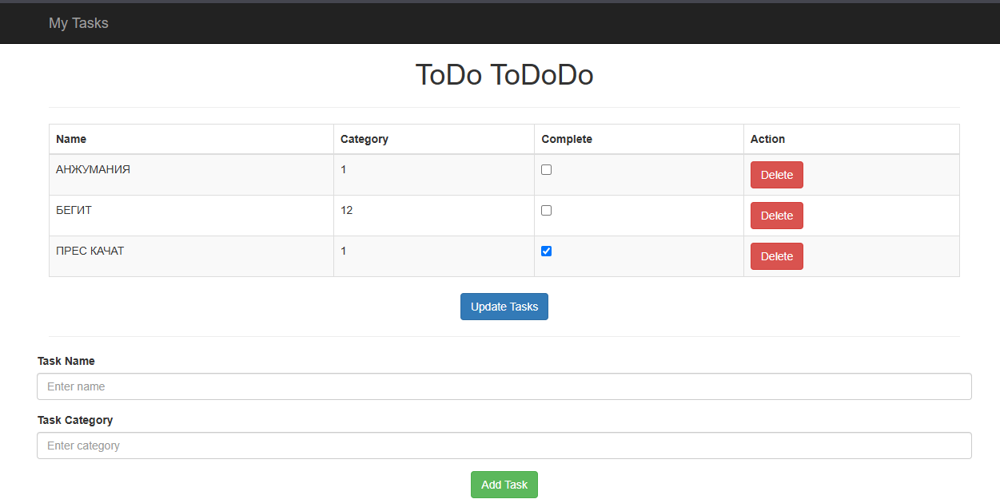

# Пример веб-приложения списка задач с использованием Spring Boot, MySQL, Lombok, HTTP, REST запросов, CSS.

Простое приложение списка задач, использующее Spring Boot, с следующими опциями:

- Spring JPA и MySQL для сохранения данных.
- Шаблон Thymeleaf для отображения.

## Для сборки и запуска примера с нового клона этого репозитория:

### Настройка MySQL

1. Создайте базу данных в вашей MySQL-системе.
2. Обновите файл `application.properties` в папке `src/main/resources`, указав URL, имя пользователя и пароль для вашей MySQL-системы. Схема таблицы для объектов Todo будет создана для вас в базе данных.

### Сборка и запуск примера

**Примечание**: Для этого требуется JDK версии Java 11. Было протестировано с OpenJDK v11.0.6.

1. Сборка проекта:
   ```sh
   ./mvnw package
   ```
2. Запуск приложения:
   ```sh
   java -jar target/TodoDemo-0.0.1-SNAPSHOT.jar
   ```
3. Откройте веб-браузер и перейдите по адресу: [http://localhost:8080](http://localhost:8080)

### Проверка изменений в базе данных

По мере добавления и обновления задач в приложении вы можете проверить изменения в базе данных через консоль MySQL с помощью простых запросов, таких как:

```sql
SELECT * FROM todo_item;
```

### Изменения в Readme

Визуальный пример моего проекта:


